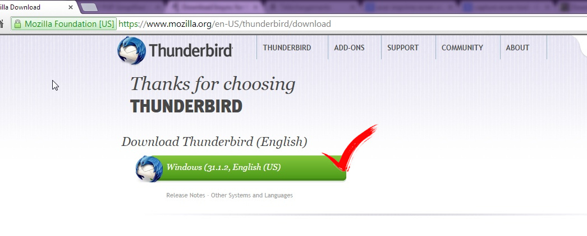
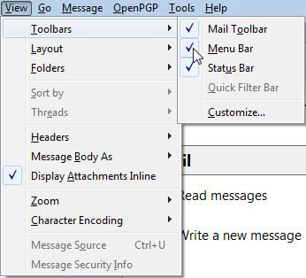
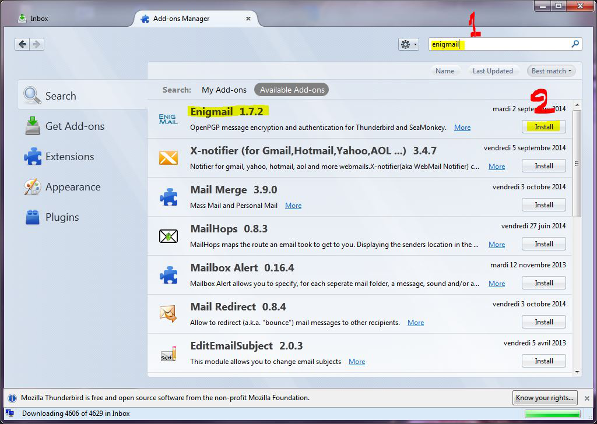
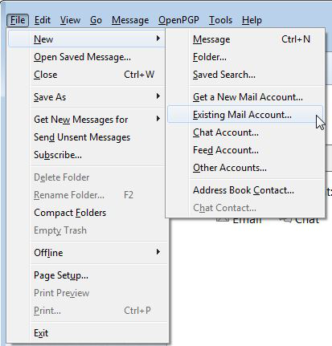
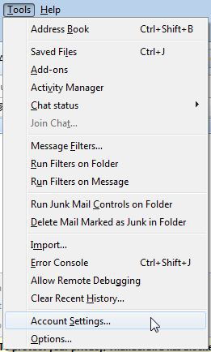
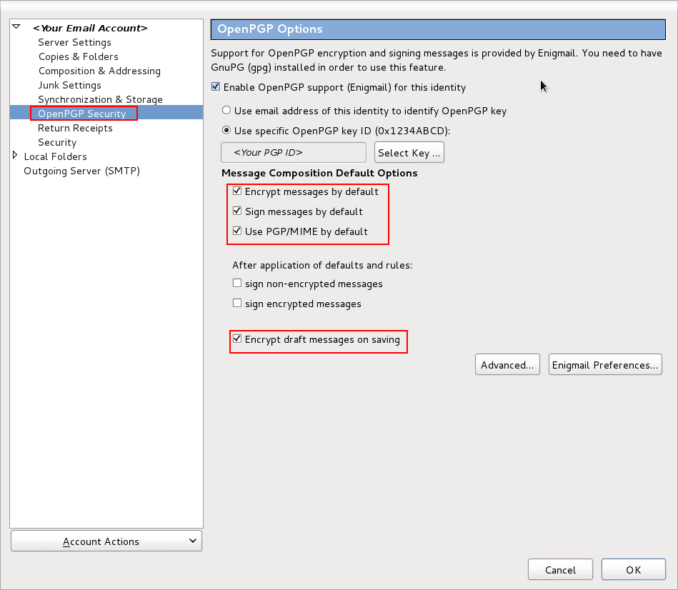
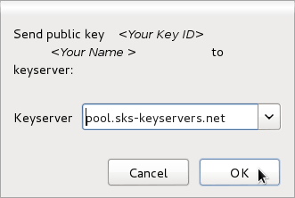

---

Instituto: 'Tecnológico de Costa Rica'
InstitutoURL: 'tec.ac.cr'
InstitutoAcercaDe: 'El Tecnológico de Costa Rica (TEC) es una institución nacional autónoma de educación superior universitaria, dedicada a la docencia, la investigación y la extensión de la tecnología y ciencias conexas para el desarrollo de Costa Rica. Fue creado mediante ley No. 4777 del 10 de junio de 1971.'

Escuela: 'Escuela de Ingeniería Computación'

Titulo: 'Sellado de Tiempo con SINPE'

Abstract: 'Este proyecto trata acerca de la reparación,el mejoramiento y la implementacion de la tecnología de los Arduinos en un futbolín, dicha tecnología se usara para el conteo de goles automatizado, utilizando un LCD y un sensor de Luz.'

Keywords: 'Futbolín, Arduino, Marcador'

Clasificacion: 'Público'

Autor:
- Nombre: 'Kevin Moraga'
  Bio: 'Ingeniero en Computación del Tecnológico de Costa Rica, Master en Ciencias de la Computación del Tecnológico de Costa Rica. Es profesor del Tecnológico de Costa Rica y actualmente es el coordinador de la Oficina de TI de la Escuela de Ingeniería en Computación del Tecnológico de Costa Rica de la Sede Interuniversitaria.'
- Nombre: 'Juan Perez'
  Bio: 'Estudiante avanzado de la carrera de Ingeniería en Computación del Tecnológico de Costa Rica, forma parte del proyecto "Módulo Óptico para Sistemas de Puntos aplicado en Mesas de Juego" de la escuela de Computación de ITCR. Actualmente es miembro la oficina de TI de la misma escuela.'

---

# Download and Install GPG4Win

## Download

Download the most recent version of GPG4Win, the encryption manager from [here](http://gpg4win.org/download.html). The light version contains all the required software.

## Check Integrity

As with all software, it is really important to check the [integrity](https://en.wikipedia.org/wiki/Data_integrity) of the downloaded software, specially since GPG4Win is only available through a non secure connection.

There are various ways to verify the integrity of the file. You can follow this [easy steps](https://guides.accessnow.org/windows/integriry_check) to guarantee the downloaded file was not modified in transit.

## Install

Double click the downloaded file and complete the installation.

# Download and Install Thunderbird

## Download

Download Thunderbird, the email manager from [here](https://www.mozilla.org/en-US/thunderbird/download).

## Install

Double click the downloaded file and complete the installation. Do not perform any configuration or add any account at this time.

### Display the Menu Bar

In Thunderbird, press ALT on your keyboard. This will display the Menu Bar. Then go to View > Toolbars and check Menu Bar.

# Download and Install Enigmail

## Open Add-On's Menu

In Thunderbird go to Tools > Add-Ons.

## Search and Install

Type "Enigmail" on the search filed. Hit search and installed just as shown below.

## Restart Thunderbird

# Link your Existing Email Address

## Add your account

For Gmail Account before porceed in this config make sure that the two step-verification is Disabled and the Access for less secure apps is Enbaled from this link: https://www.google.com/settings/security/lesssecureapps

In Thunderbird go to File > New > Existing Mail Account

## Complete the account Details

Complete your name, email address and password. It’s important that you fill your First and Last names if you want to let the receiver recognize you as so.

Click on continue. Thunderbird will automatically set up the appropriate ports for the connections with your mail server. Otherwise you might have to set up the ports manually using your email provider settings. Make sure both the outgoing and incoming email connections support TLS. If its not supported, please contact Access Helpline to work with your email provider on this issue.

Please remember to create an [App Password](https://support.google.com/mail/answer/1173270?hl=en) if you are using two-factor-authentication with Google.

Create your Private and Public key : Your Key pair
==================================================

## Open Key Management Interface

On Thunderbird, go to Enigmail > Key Management.

## Display all the keys

The following window should appear, click the check box Display All Keys by Default.

## Generate a New Key Pair

On Key Management Window, go to Generate > New Key Pair. A new Window will pop up.

## Configure your key 

Pick a [solid passphrase]() for your private key. Remember this key, otherwise all the information encrypted with this key will be lost.

Include your full name in the comment line.

Verify that key size of **4096.** is selected This option makes your encryption a lot tougher.

Click on Generate Key and confirm.

## Generate the revocation certificate

The system will ask you to create a revocation certificate. Generating it will give you the possibility to not revoke your key in the future. This certificate must be stored on a super safe place, such as a USB drive, SD card or DVD. Some storage medium that will be used only for this purpose.

Click on Generate Certificate, it will ask you for the path of the safe storage device and your Pass-phrase.

Backup your key pair
====================

For this step you will need again the super safe storage drive, used on the previous step.

## Open the Key Management Interface

On Thunderbird, go to Enigmail > Key Management.

## Export your key

Select your private key. It will appear on the Key Management interface in bold letters. Right click your key on Keys list and choose *Export Keys to File*. Choose explicitly *Export Secret Key.* Store it in the secure drive mentioned before.

You will export your public and private key. The private key is the most critical component of the encryption system and it should be kept in a very secure place.

Linking your Key to your Email Address
======================================

Now that you have a key pair, the next step is linking your key to your email address.

## 1- Open Account Settings Menu

On Thunderbird go to Tools > Account Settings.

## Configuring Encryption

On the left side, click on "OpenPGP Security" settings of the account you are configuring. Verify that your Key is Selected.

In this window different options on how to use email encryption will be available. We recommend you check on "Encrypt messages by default", "Sign messages by default" and "Use PGP/MIME by default". Unless you believe using encryption by default may increase unwanted attention or might put you on risk, we suggest you choose signing and encrypting by default.

Please make sure the option "Encrypt draft messages on saving" is also selected. We don't want to leave unencrypted drafts of sensitive emails!

Sharing your Public Key
=======================

If someone wants to send you an encrypted GPG email, they will need your public key. You can share your key by email or make it publicly available to everyone by uploading it to well known key servers.

Please take in consideration that your key can not be removed from the keyservers, therefore, if you do not want the whole world to know that you are using encryption avoid this steps, and share your key through an email with your trusted network.

## Option 1 - Uploading your key to the keyservers

To make this key available publicly, please complete the following steps.

### Open the Key Management Interface

On Thunderbird, go to Enigmail > Key Management.

### Publish your Key

Select your private key. It will appear on the Key Management interface in bold letters. Right click your key on Keys list and choose *Upload Public Key to Keyserver*.

## Option 2 - Sharing your key by Email

To send your key to your trusted contacts please perform the following steps.

### Compose a new message

On thunderbird main interface, click on the "Write" icon.

### Attach your key

On the Enigmail Menu, Click on the "Attach My Public key".

Include your contacts and add a proper subject to the email.

