

Download and Install GPG4Win
============================

**Step 1- Download**

Download the most recent version of GPG4Win, the encryption manager from [here](http://gpg4win.org/download.html). The light version contains all the required software.

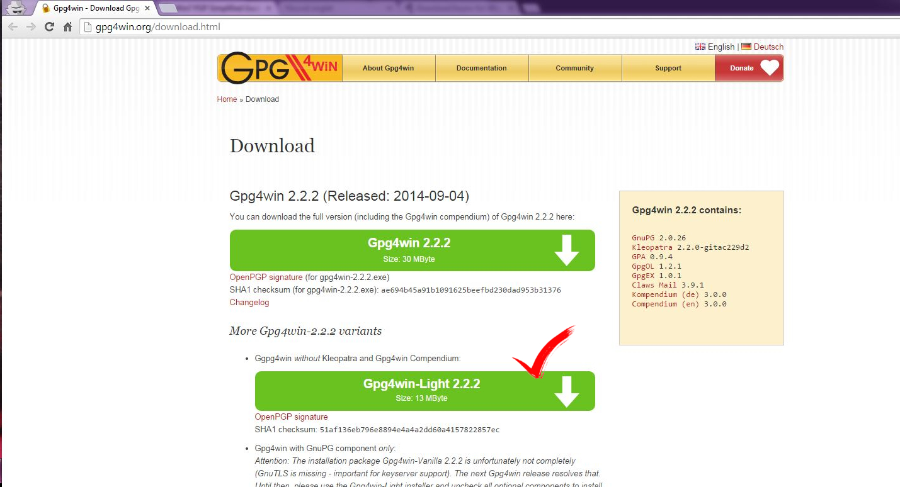

**Step 2- Check Integrity**

As with all software, it is really important to check the [integrity](https://en.wikipedia.org/wiki/Data_integrity) of the downloaded software, specially since GPG4Win is only available through a non secure connection.

There are various ways to verify the integrity of the file. You can follow this [easy steps](https://guides.accessnow.org/windows/integriry_check) to guarantee the downloaded file was not modified in transit.

**Step 3- Install**

Double click the downloaded file and complete the installation.

Download and Install Thunderbird
================================

**Step 1- Download**

Download Thunderbird, the email manager from [here](https://www.mozilla.org/en-US/thunderbird/download).

**Step 2- Install**

Double click the downloaded file and complete the installation. Do not perform any configuration or add any account at this time.

**Step 3- Display the Menu Bar**

In Thunderbird, press ALT on your keyboard. This will display the Menu Bar. Then go to View > Toolbars and check Menu Bar.

Download and Install Enigmail
=============================

**Step 1- Open Add-On's Menu**

In Thunderbird go to Tools > Add-Ons.

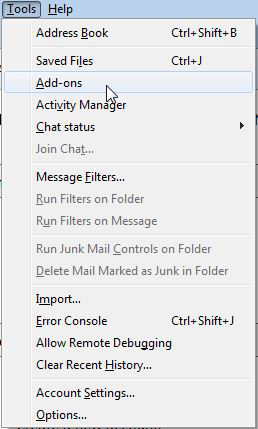

**Step 2- Search and Install**

Type "Enigmail" on the search filed. Hit search and installed just as shown below.

**Step 3- Restart Thunderbird**

Link your Existing Email Address
================================

**Step 1- Add your account**

For Gmail Account before porceed in this config make sure that the two step-verification is Disabled and the Access for less secure apps is Enbaled from this link: https://www.google.com/settings/security/lesssecureapps

In Thunderbird go to File > New > Existing Mail Account

**Step 2- Complete the account Details**

Complete your name, email address and password. It’s important that you fill your First and Last names if you want to let the receiver recognize you as so.

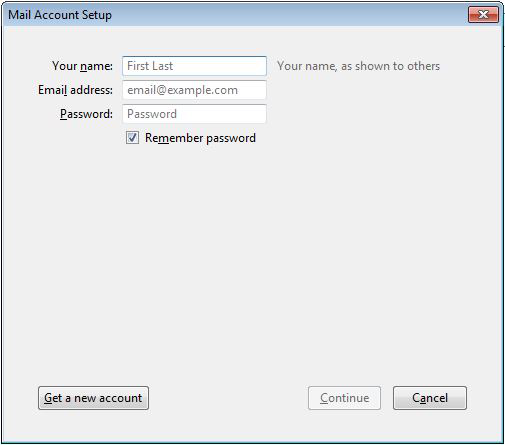

Click on continue. Thunderbird will automatically set up the appropriate ports for the connections with your mail server. Otherwise you might have to set up the ports manually using your email provider settings. Make sure both the outgoing and incoming email connections support TLS. If its not supported, please contact Access Helpline to work with your email provider on this issue.

Please remember to create an [App Password](https://support.google.com/mail/answer/1173270?hl=en) if you are using two-factor-authentication with Google.

Create your Private and Public key : Your Key pair
==================================================

**Step 1- Open Key Management Interface**

On Thunderbird, go to Enigmail > Key Management.

**Step 2- Display all the keys**

The following window should appear, click the check box Display All Keys by Default.

**Step 3- Generate a New Key Pair**

On Key Management Window, go to Generate > New Key Pair. A new Window will pop up.

**Step 4- Configure your key **

Pick a [solid passphrase]() for your private key. Remember this key, otherwise all the information encrypted with this key will be lost.

Include your full name in the comment line.

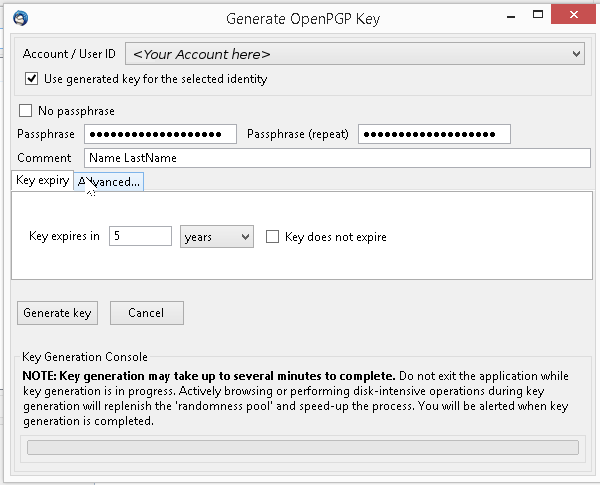

Verify that key size of **4096.** is selected This option makes your encryption a lot tougher.

Click on Generate Key and confirm.

**Step 5- Generate the revocation certificate**

The system will ask you to create a revocation certificate. Generating it will give you the possibility to not revoke your key in the future. This certificate must be stored on a super safe place, such as a USB drive, SD card or DVD. Some storage medium that will be used only for this purpose.

Click on Generate Certificate, it will ask you for the path of the safe storage device and your Pass-phrase.

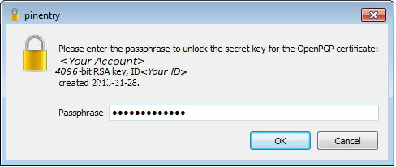

Backup your key pair
====================

For this step you will need again the super safe storage drive, used on the previous step.

**Step 1- Open the Key Management Interface**

On Thunderbird, go to Enigmail > Key Management.

**Step 2- Export your key**

Select your private key. It will appear on the Key Management interface in bold letters. Right click your key on Keys list and choose *Export Keys to File*. Choose explicitly *Export Secret Key.* Store it in the secure drive mentioned before.

You will export your public and private key. The private key is the most critical component of the encryption system and it should be kept in a very secure place.

Linking your Key to your Email Address
======================================

Now that you have a key pair, the next step is linking your key to your email address.

**Step 1- Open Account Settings Menu**

On Thunderbird go to Tools > Account Settings.

**Step 2- Configuring Encryption**

On the left side, click on "OpenPGP Security" settings of the account you are configuring. Verify that your Key is Selected.

In this window different options on how to use email encryption will be available. We recommend you check on "Encrypt messages by default", "Sign messages by default" and "Use PGP/MIME by default". Unless you believe using encryption by default may increase unwanted attention or might put you on risk, we suggest you choose signing and encrypting by default.

Please make sure the option "Encrypt draft messages on saving" is also selected. We don't want to leave unencrypted drafts of sensitive emails!

Sharing your Public Key
=======================

If someone wants to send you an encrypted GPG email, they will need your public key. You can share your key by email or make it publicly available to everyone by uploading it to well known key servers.

Please take in consideration that your key can not be removed from the keyservers, therefore, if you do not want the whole world to know that you are using encryption avoid this steps, and share your key through an email with your trusted network.

Option 1 - Uploading your key to the keyservers
-----------------------------------------------

To make this key available publicly, please complete the following steps.

**Step 1- Open the Key Management Interface**

On Thunderbird, go to Enigmail > Key Management.

**Step 2- Publish your Key**

Select your private key. It will appear on the Key Management interface in bold letters. Right click your key on Keys list and choose *Upload Public Key to Keyserver*.

Option 2 - Sharing your key by Email
------------------------------------

To send your key to your trusted contacts please perform the following steps.

**Step 1 - Compose a new message**

On thunderbird main interface, click on the "Write" icon.

**Step 2 - Attach your key**

On the Enigmail Menu, Click on the "Attach My Public key".

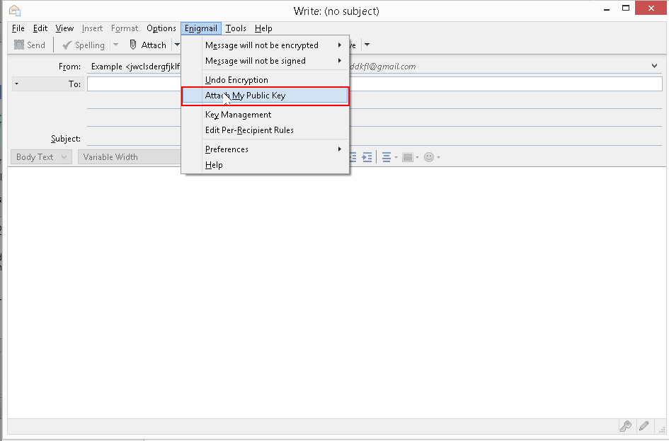

Include your contacts and add a proper subject to the email.

Getting Someone's GPG Public Key
================================

To be able to send an encrypted email to another person you will need to have their **PGP Public key** in your keyring. There are different options for importing this keys, the most common ones are:

Option 1 - Importing a key from file
------------------------------------

If your contact sent your his/her key through an email, you can follow this steps to import their key.

**Step 1- Open Key Management Interface**

On Thunderbird, go to Enigmail > Key Management.

**Step 2- Open Menu Import key from File**

On the Key management window go to File > Import Keys from File.

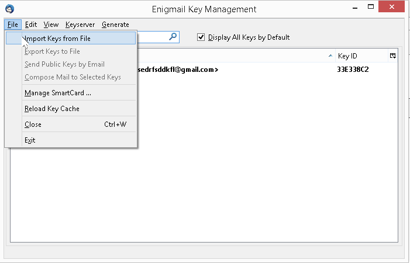

**Step 3- Select key from File**

Select the key you want to import and click open.

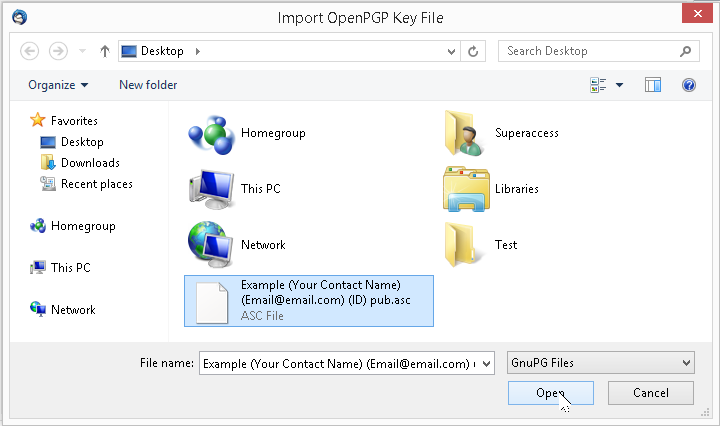

Option 2 - Importing key from keyservers
----------------------------------------

If your contact published his/her key on one of the available keyservers, you can look for their key using the email address or fingerprint.

**Step 1- Open Key Management Interface**

On Thunderbird, go to Enigmail > Key Management.

**Step 2- Open Menu Import key from File**

On the Key management window go to Keyserver > Search for Keys.

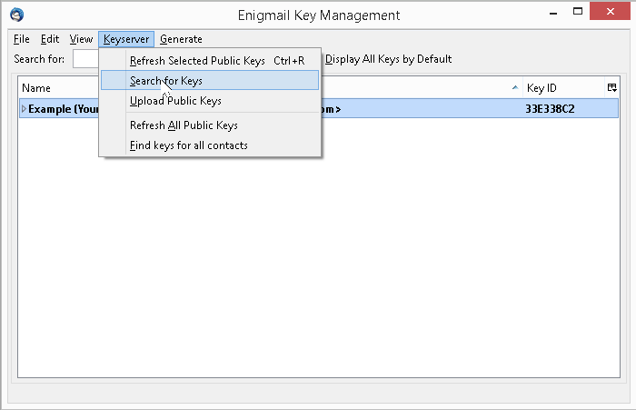

**Step 3- Input the email/Key ID**

On the "Search for key" field, input your contact email or PGP ID and hit okay.

**Step 4- Input the email/Key ID**

On the "Search for key" field, input your contact email or PGP ID and hit okay.

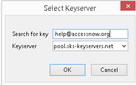

**Step 5- Select the appropriate key**

The search results will appear in a new window. Select the appropriate key (verify the key fingerprint) and click okay.

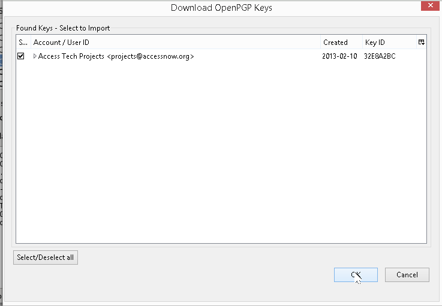

**Step 6- Confirm**

A confirmation window will appear. Click okay.

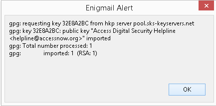

Sending an Encrypted Email
==========================

We are ready to test our GPG configuration! Please follow this steps to send your first encrypted email.

**Step 1- Go To Compose Interface**

On thunderbird main interface, click on the "Write" icon.

**Step 2- Compose the email**

Write your email. The subject line will not be encrypted, so do not include sensitive information in the subject field.

You should have already imported the public keys of the recipients. If you haven't go to [this section](#Getting_Public_key) and import it.

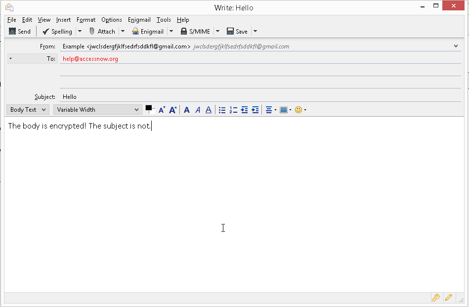

**Step 3- Verify Email Encryption**

Depending on the selection you made on the previous steps, your emails will or will not be encrypted by default. You can verify the current selection on the icons in the bottom. The yellow key indicates the email will be encrypted and the yellow pencil indicates the email will be signed.

Make sure your email will be encrypted!!!

**Step 4- Send!**

Receiving an Encrypted Email
============================

**Step 1- Select the Encrypted Email**

When you receive an encrypted email, Enigmail will automatically ask you for the pass-phrase of your GPG key.

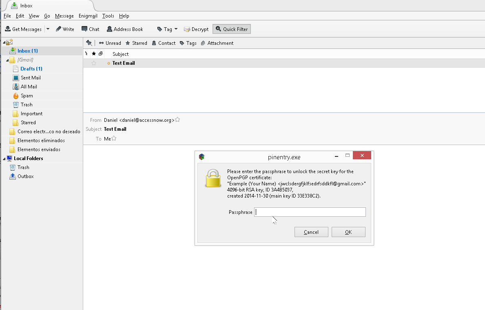

**Step 2- Read your email**

After you input your pass-phrase correctly you will see the decrypted content of your message.

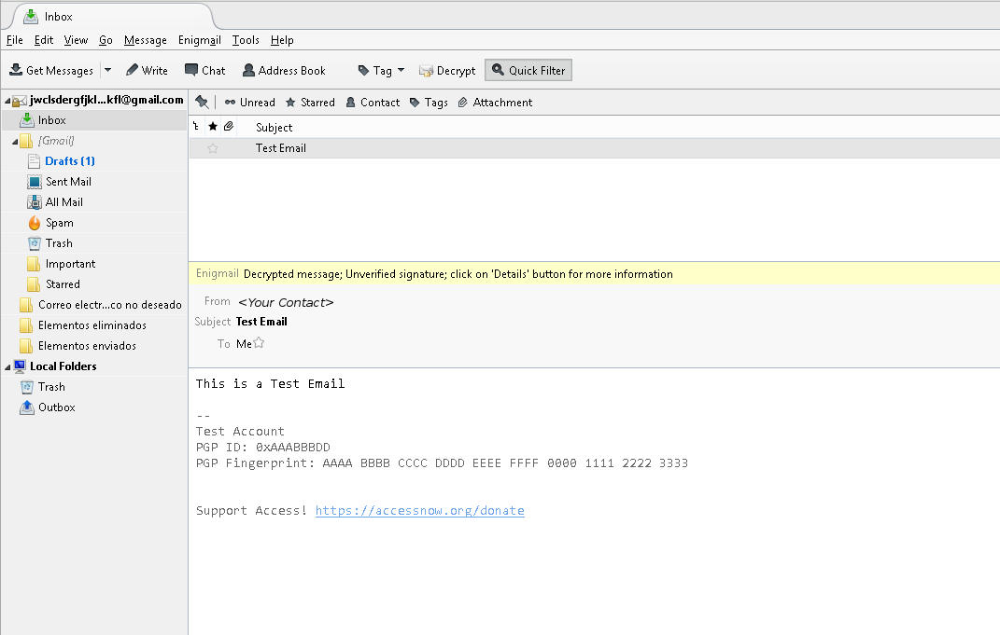

Optional Configuration - Adding your ID to the Email Signature
==============================================================

To let others know what your PGP ID we recommend you include it in your email signature.

**Step 1- Getting Your PGP ID**

On Thunderbird, go to Enigmail > Key Management.

You will see the list of all the keys that your currently have on your key ring. On bold letters your will see your pairs of public and private keys. Right next to id you will find your PGP Key ID. This will identify your key.

**Step 2- Open Account Settings Menu**

On Thunderbird go to Tools > Account Settings. A new window will appear.

**Step 3- Adding your Signature**

On the left side, click on the settings of the account you are configuring. Verify your name, email address and complete your signature with your PGP ID.

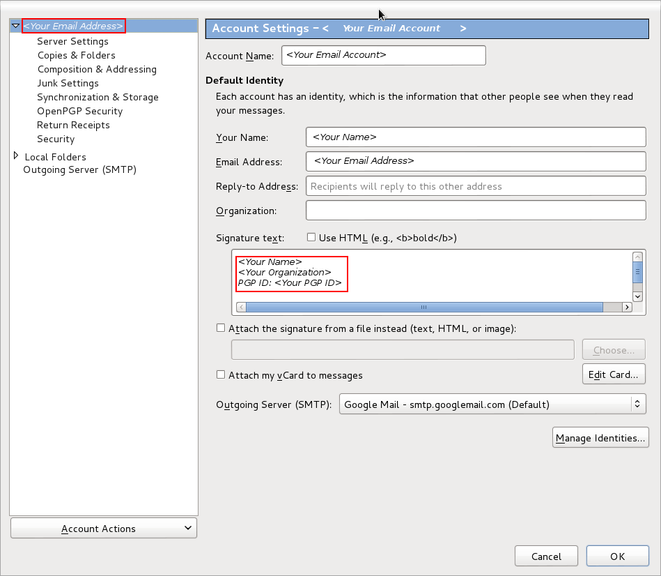

In case you disabled the two steps verification please make sure to re-enable it. Then `Reconnect your apps and devices` option then deconnect from Thunderbird once Thunderbird ask for password put the generated google apps password.
